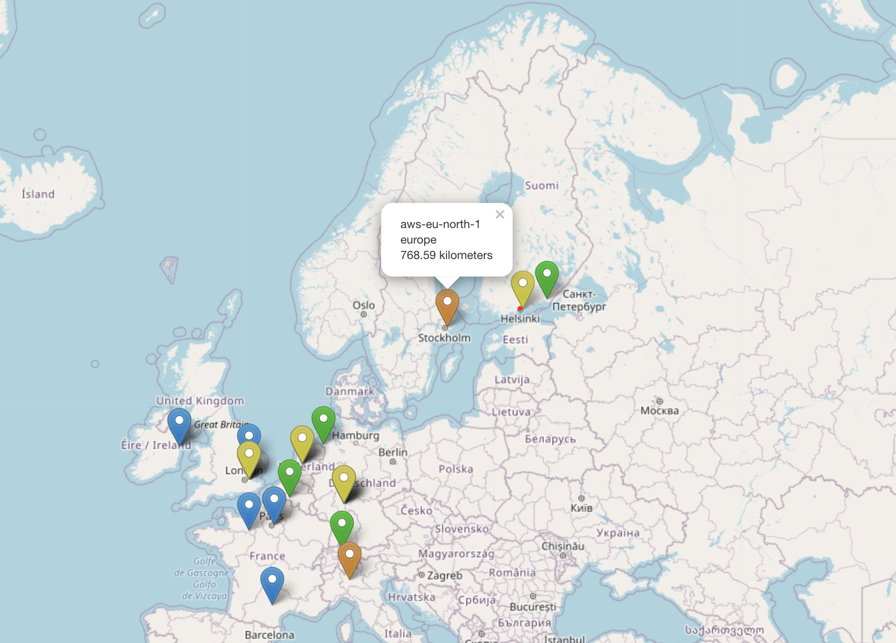

# Cloudmap

## Running

Run with docker-compose

`docker-compose up`

After running docker-compose view the app from [localhost](http://localhost/)

---

## Developing

### Backend

Created with python flask and [graphene](https://graphene-python.org/)

- Create and activate python3 venv:

     `python3 -m venv cloudmapvenv`

     `. cloudmapvenv/bin/activate`

- Install requirements:

     `pip install -r requirements.txt`

- Run backend server:

     `python src/server.py`

After running the server, you can test the graphql-api with [localhost:5000/graphiql](http://localhost:5000/graphql?variables=null&operationName=awsEuropeClouds&query=query%20awsEuropeClouds%20%7B%0A%20%20clouds(name%3A%20%22aws%22%2C%20region%3A%20%22europe%22)%20%7B%0A%20%20%20%20name%0A%20%20%20%20cloudProvider%0A%20%20%20%20cloudDescription%0A%20%20%20%20geoRegion%0A%20%20%20%20geoLatitude%0A%20%20%20%20geoLongitude%0A%20%20%7D%0A%7D%0A)

Current api solution supports filtering by name and service region.

---

### Frontend

Created with create-react-app.

- install dependencies:
  
  `npm install`

- run with:

  `nmp start`

view [localhost:3000](http://localhost:3000/)

